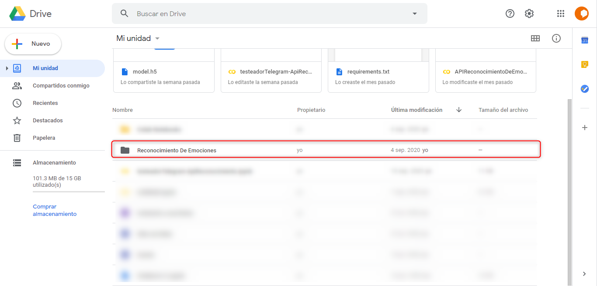
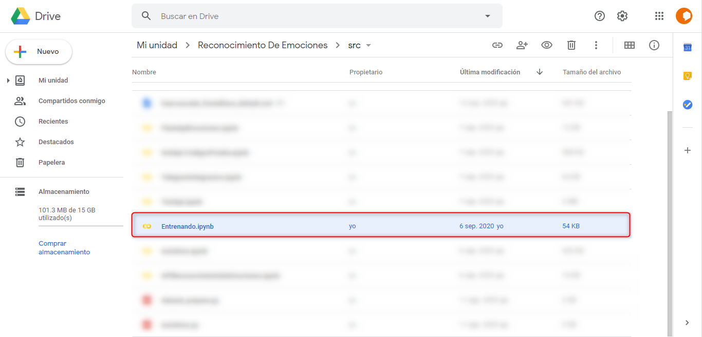
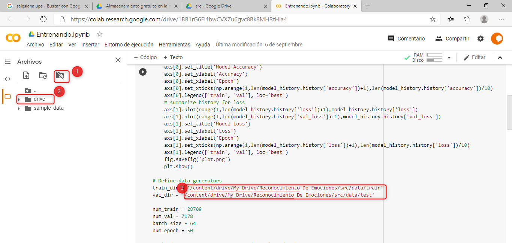

# API-ReconocimientoEmociones

## Derechos de Autor
Este Proyecto se baso en el proyecto de este github https://github.com/atulapra/Emotion-detection , para desarrollo didacticos

## Introduccion
Este proyecto se lo desarrollo usando la herramienta gratuita de Google Colab , ya que esa herramienta es gratuita y facil de utilizar, se desarollo una Api con flask y ngrok 
que recibe una peticion POST en la cual se le debe enviar una imagen y la api tiene una funcion que procesa la imagen para reconocer una emocion en base al modelo ya previamente
entrenado, para este proyecto se trabajo con la api de telegram ya que queriamos realizar un ejemplo que integre una red social y nuestra api de reconocimiento de emociones.

## Dependencies
Python 3, OpenCV, Tensorflow

## Guia de implementacion 

### Google Colab

#### 1.- En nuestro google drive subimos los archivos

#### 2.- En la carpeta src se encuentran los archivos para ejecutar, el primer archivo que ejecutaremos es Entrenado

#### 3.- Una de las primeras cosas que hay que asegurarnos es montar el gdrive al proyecto, y revisar las rutas en donde se encuentra nuestros archivos de imagenes para train y test

