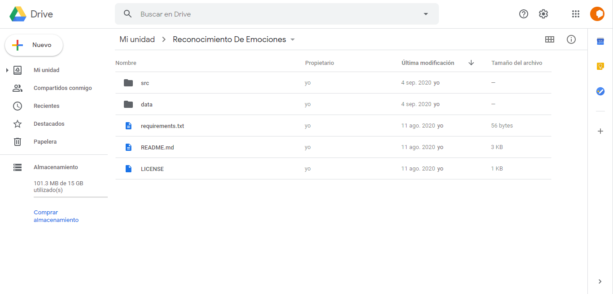
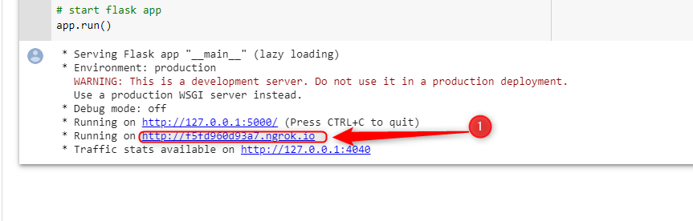

# API-ReconocimientoEmociones

## Derechos de Autor
Este Proyecto se baso en el proyecto de este github https://github.com/atulapra/Emotion-detection , para desarrollo didacticos

## Introduccion
Este proyecto se lo desarrollo usando la herramienta gratuita de Google Colab , ya que esa herramienta es gratuita y facil de utilizar, se desarollo una Api con flask y ngrok 
que recibe una peticion POST en la cual se le debe enviar una imagen y la api tiene una funcion que procesa la imagen para reconocer una emocion en base al modelo ya previamente
entrenado, para este proyecto se trabajo con la api de telegram ya que queriamos realizar un ejemplo que integre una red social y nuestra api de reconocimiento de emociones.

## Dependencies
Python 3, OpenCV, Tensorflow

## Guia de implementacion 

### Google Colab

#### 1.- En nuestro google drive subimos los archivos

#### 2.- En la carpeta src se encuentran los archivos para ejecutar, el primer archivo que ejecutaremos es Entrenado

#### 3.- Una de las primeras cosas que hay que asegurarnos es montar el gdrive al proyecto, y revisar las rutas en donde se encuentra nuestros archivos de imagenes para train y test

#### 4.- Una vez que termine el entrenamiento se creara una arhcivo llamado model.h5 el cual podras descargarlo en tu compu para luego subirlo

#### 5.- Los archivos model.h5 y haarcascade_frontalface_default se encuentran subidos en este proyecto, pero el model.h5 siempre se puede mejorar si se agregan mas imagenes en la ruta de train y test para asi poder mejorar el algoritmo

#### 6.- Ahora el archivo que nos permitira usar el api sera FlaskApiEmociones

#### 7.- En este archivo hay que asegurarnos nuevamente montar nuestro gdrive, y cambiar la ruta respectiva en la cual se subio los archivos para poder cargar el modelo entrenado, adicional esta creado un diccionario de emociones, y al final esta una variable fecha que nos crea el el nombre de la imagen con el año,mes,dia,hora,minuto y segundo de la primera imagen que nos envian para luego hacer lo mismo pero grabando el rostro detectado

#### 8.- Una vez que este todo correcto al final se debe ejecutar sin problemas y podremos ver la ruta publica que nos brinda ngrok que siempre va a cambiar cuando ejecutemos el programa

